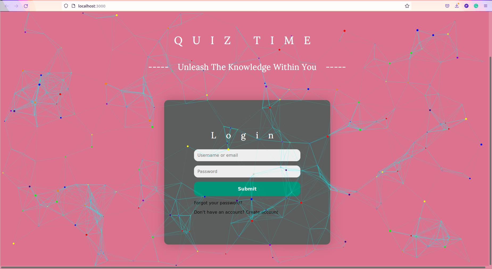

# QuizTime
Description: A Web App, having options of test, performance, statistics, marks wise distribution✨, etc. 
The Test gets submitted automatically after completion of given time. Switching Browser tabs wont be allowed when in Test Mode.Timer will also be displayed⏳.
Some background modifications(mobile background).

## Team Members:  
Priyal Awankar [priyalawankar@gmail.com](priyalawankar@gmail.com)
   
Astitva Aggarwal     
Harsh Singh [hmsingh_b20@it.vjti.ac.in](hmsingh_b20@it.vjti.ac.in)     
Omkar Kamble [oskamble_b20@ce.vjti.ac.in](oskamble_b20@ce.vjti.ac.in)   

## Mentors Name :  
Kush Kothari  
Reshmika  
Jatin  

## Features implemented : 
Created the Login page with the sign in ,forget password ,asking for account status,etc
Added the particle theme .
We have completed the login page .

